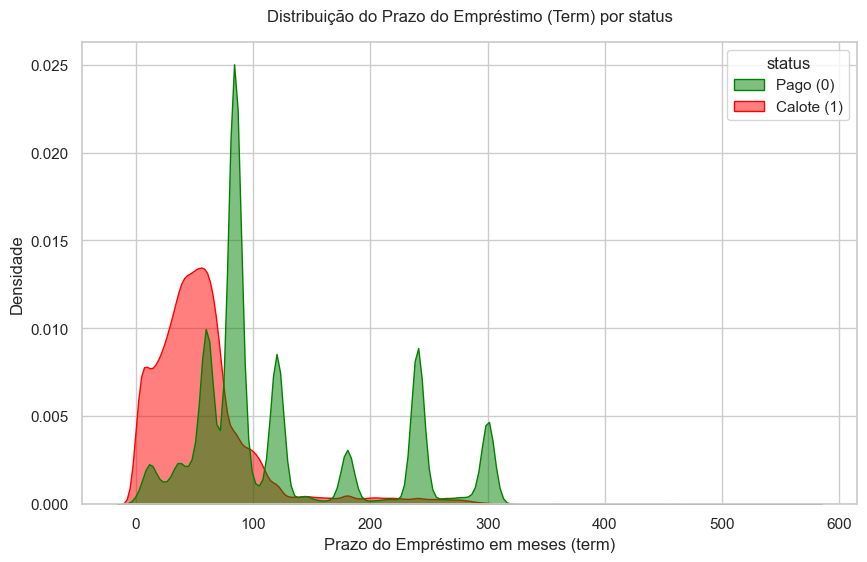
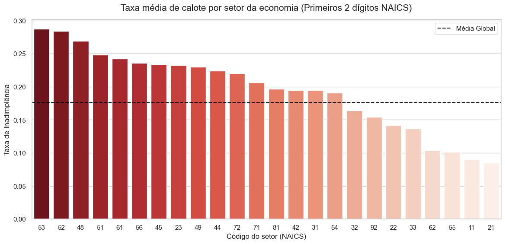
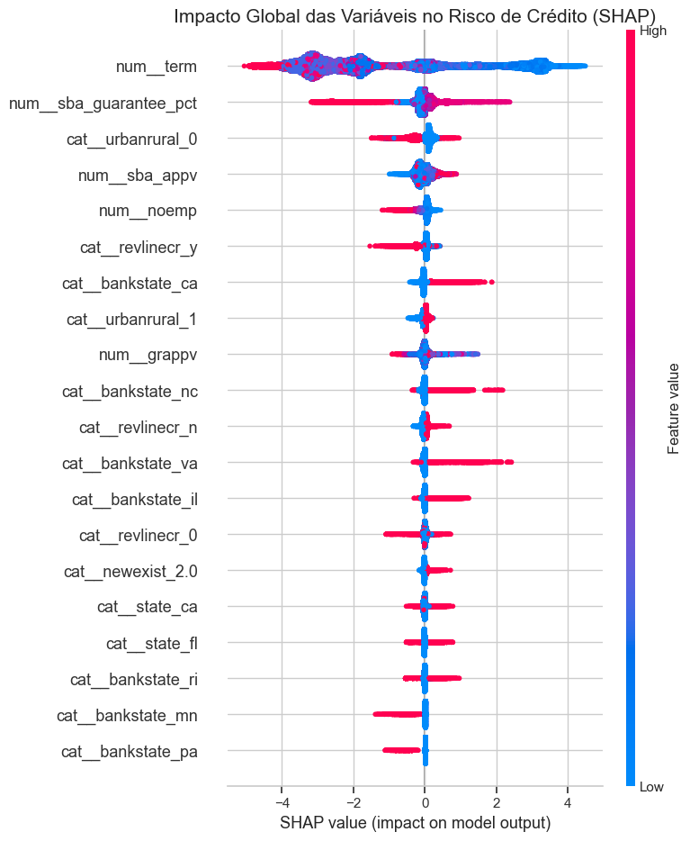

# SBA Intelligence: Predição de Risco de Crédito com IA Explicável 📊🚀


---

## Aplicação Web (Live Demo)
O modelo preditivo já está em produção! Teste a interface interativa e veja as explicações da IA em tempo real acessando o link abaixo:

👉 **[Acessar o Dashboard: SBA Intelligence App](https://sbacredit-0hk1ep0c4h2.streamlit.app/)**

---

## 1. A Dor do Negócio (O Problema)
Instituições financeiras operam em um cenário de alto risco onde a **inadimplência (default)** pode drenar bilhões em capital anualmente. O grande desafio dos modelos tradicionais ou das análises puramente manuais é o equilíbrio entre agilidade e precisão. 

Muitas vezes, algoritmos avançados são vistos como **"caixas-pretas"**, o que gera insegurança jurídica e dificulta a transparência nos processos de concessão de crédito. Para pequenas empresas (SBA - Small Business Administration), onde as margens são estreitas, um erro de classificação pode significar o fechamento de um negócio legítimo ou um prejuízo irrecuperável para o banco.

---

## 2. A Solução
Desenvolvi um motor preditivo **end-to-end** que automatiza a análise de risco de crédito utilizando o algoritmo **XGBoost**. 

O diferencial deste projeto é a camada de **IA Explicável (XAI)** integrada. Através da biblioteca **SHAP**, o sistema não apenas diz se um empréstimo é de risco, mas aponta matematicamente quais fatores (como prazo, setor ou garantias) pesaram mais na decisão, transformando a "caixa-preta" em um processo auditável e compreensível para os analistas de negócios.

---

## 3. Performance do Modelo (Métricas Executivas)
O modelo foi treinado e validado com foco extremo na proteção do capital, priorizando a identificação de maus pagadores.

| Métrica | Resultado | Impacto de Negócio |
| :--- | :--- | :--- |
| **AUC-ROC** | **0.96** | Altíssima capacidade do modelo em separar matematicamente bons e maus pagadores. |
| **Recall (Calotes)** | **0.90** | **90% dos potenciais caloteiros são interceptados preventivamente pelo sistema.** |
| **Precisão** | **0.88** | Baixa taxa de falsos alarmes, evitando atritos desnecessários com bons clientes. |

> **Nota do Cientista:** Em projetos de risco de crédito financeiro, o **Recall** é a métrica principal. O custo de aprovar um mau pagador (Falso Negativo) é assimetricamente maior do que o custo de revisar um bom pagador (Falso Positivo).

---

## 4. Insights do Projeto (Visualizações)
Abaixo, os principais padrões ocultos descobertos durante a Análise Exploratória de Dados (EDA):

### Prazo do Empréstimo (Term) vs. Inadimplência

> **Insight:** Identificamos que empréstimos com prazos curtos possuem uma densidade de calote significativamente maior, o que indica uma alta pressão no fluxo de caixa de curto prazo do empresário.

### Risco por Setor Econômico (NAICS)

> **Insight:** O risco não é distribuído de forma homogênea. Setores específicos (como alimentação e varejo) apresentam taxas históricas de default superiores à média, exigindo políticas de garantia (colaterais) mais rigorosas.

### A "Caixa-Preta" Aberta (SHAP Values)

> **Insight:** O `summary_plot` revela que o prazo do empréstimo (`term`) e a porcentagem de garantia governamental (`sba_guarantee_pct`) são os maiores influenciadores da decisão preditiva, superando até mesmo o valor bruto do dinheiro solicitado.

---

## 5. Tecnologias Utilizadas
* **Linguagem:** Python 3.9+
* **Manipulação de Dados:** Pandas, NumPy
* **Machine Learning:** Scikit-Learn, XGBoost
* **Explicabilidade (XAI):** SHAP (Shapley Additive Explanations)
* **Interface Web / Dashboard:** Streamlit
* **Serialização de Modelos:** Joblib

---

## 6. Como Executar o Projeto Localmente

### Passo 1: Clonar o repositório e acessar a pasta
```bash
git clone [https://github.com/seu-usuario/seu-repositorio.git](https://github.com/seu-usuario/seu-repositorio.git)
cd seu-repositorio

### Passo 2: Criar e ativar o ambiente virtual (Recomendado)
```bash
# Windows
python -m venv .venv
.venv\Scripts\activate

# Linux/Mac
python3 -m venv .venv
source .venv/bin/activate

### Passo 3: Instalar as dependências
```bash
pip install -r requirements.txt

### Passo 4: Executar a Aplicação Web
```bash
streamlit run app.py